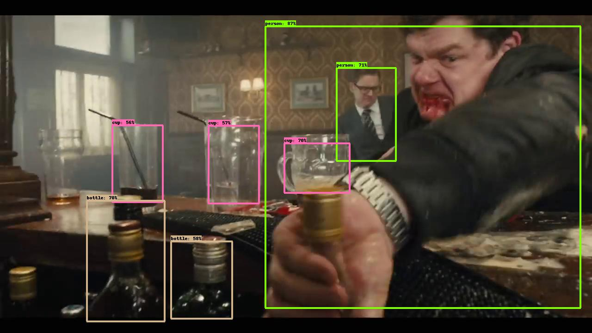

# Seq_nms_YOLO

#### Membres: Yunyun SUN, Yutong YAN, Sixiang XU, Heng ZHANG

---

## Introduction

 

This project combines **YOLOv2**([reference](https://arxiv.org/abs/1506.02640)) and **seq-nms**([reference](https://arxiv.org/abs/1602.08465)) to realise **real time video detection**.

## GitHub setup

In case you want to work with github (not just download the code), you must clone the repository via ssh. If this is not the case you can skip this configuration and download the code as zip from the github website or clone it without ssh.

> The eps labs have the ssh port closed, so the git clone command may be stuck. In this case use another computer to avoid it or request to open the port.


1. Create an ssh key

    ```bash
    ssh-keygen -t rsa -b 4096 -C "<your mail>"
    ```
2. Add the public key as a deployment key in the repository [here](https://github.com/pablomm/seq_nms_yolo/settings/keys). The content of the public key can be printed as

    ```bash
    cat ~/.ssh/id_rsa.pub
    ```


## Set up

The following steps include instructions for compiling and installing the necessary dependencies on the EPS-UAM computers (year 2022).

1. Be sure that you have a bash terminal with conda properly initialized (Optional, if you are using anaconda prompt or conda is initialized you can skip this step).
    
    a. Run conda initialization comand
        
    ```bash
        conda init bash
    ```

    b. Reload the terminal (open a new one)

1. Clone this repository and open a terminal on the root folder of this repository. It can be done by running. Skip this step if files are already in you local network.

    ```bash
    git clone https://github.com/pablomm/seq_nms_yolo.git 
    cd seq_nms_yolo
    ```
    
1. Create a conda environment using the configuration file `seq_nms.yml` by running

    ```bash
    conda env create -f seq_nms.yml
    ```

    This will create a new conda virtual environment named `seq_nms`.

1. Activate the new environment.

    ```bash
    conda activate seq_nms
    ```

    You will know the environment is active due to the prefix `(seq_nms)` in the terminal prompot.

1. Install pip requirements

    ```bash
    pip install -r requirements.txt
    ```


1. Include cuda libraries inside the path to be found during the compilation. 

    ```bash
    export PATH=/usr/local/cuda-10.1/bin${PATH:+:${PATH}}
    export LD_LIBRARY_PATH=$LD_LIBRARY_PATH:/usr/local/cuda-10.1/lib64
    export LIBRARY_PATH=$LIBRARY_PATH:/usr/local/cuda-10.1/lib64
    ```

1. Compile the code.

    ```bash
    make
    ```

1. Download the weights.
    ```bash
    wget https://pjreddie.com/media/files/yolo.weights
    wget https://pjreddie.com/media/files/yolov2-tiny.weights
    ```
## Testing
At this point, the code should be running properly. Test with a video example.

1. Test you are using the correct python version (the one of the environment). In can be tested by running

    ```bash
    which python
    # Expected output: /home/alumnos/<username>/.conda/envs/seq_nms/bin/python
    ```

    ```bash
    python --version
    # Expected output: Python 2.7.18 :: Anaconda, Inc.
    ```
    

1. Copy a video file to the video folder, for example, `input.mp4`. If you do not have one, could be download one by running

    ```bash
    cd video
    wget https://www.pexels.com/video/3209828/download/ -O input.mp4

    ```
1. Extract the frames of the video by running, inside the video folder, the `video2img` and `get_pkllist` scripts
    
    ```bash
    python video2img.py -i input.mp4
    python get_pkllist.py
    ```

1. Run (inside the project root folder) the `yolo_seqnms` script to generate output images

    ```bash
    cd .. # Return to the project root folder
    python yolo_seqnms.py
    ```

2. Generate a video output by running the `img2video` script inside the video folder
    
    ```bash
    cd video
    python img2video.py -i output
    ```

    The results will be saved inside the `video/output` folder


## Reference

This project copies lots of code from [darknet](https://github.com/pjreddie/darknet) , [Seq-NMS](https://github.com/lrghust/Seq-NMS) and  [models](https://github.com/tensorflow/models).